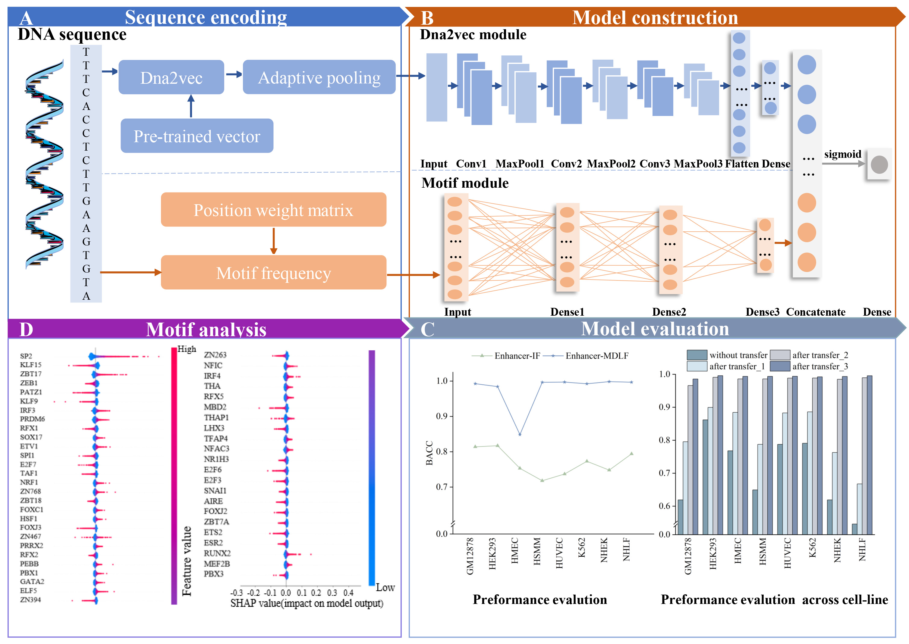

# Enhancer-MDLF
EnhancerMDLF: A novel deep learning framework for identifying cell-specific enhancers
## Framework

## Overview
The folder "**data**" contains the data of the enhancers, containing the sequences of the independent test sets and training sets on eight cell lines.  
The folder "**EPdata**" contains the data of the enhancer and promoter, containing the sequences of the independent test sets and training sets. The first half of each file is labeled as 0, and the second half is labeled as 1.  
The folder "**generic data**" contains the data of the enhancer created by Liu et al.[1], containing the sequences of the independent test sets and training sets.   
The folder "**model**" contains the trained models on eight cell lines and the pre-trained models are trained on all cell lines for use or validation.  
The folder "**dna2vec**" contains the pre-trained DNA vectors provided in dna2vec[2].  
The folder "**motif**" contains the position weight matrix (PWM) of motifs and the p-value threshold score from the HOCOMOCO Human v11 database[3].  
The file "**network.py**" is the code of the network architecture.  
The file "**main.py**" is the code of the entire model.   
The file "**dna2vec_code.py**" is the code used to extract dna2vec features.  
The file "**motif_find.py**" is the code used to extract motif features.  
The file "**SHAP.py**" is the code for exploring important motifs.  
## Dependency
Python 3.8  
tensorflow 2.2.0  
keras 2.3.1  
scikit-learn  
numpy  
See requirements.txt for all detailed libraries  
## Usage
First, you should extract features of enhancers, and run the script to extract dna2vec-based features and motif-based features as follows:  
`python dna2vec_code.py`  
`python motif_find.py`  
Then run the script as follows to compile and run Enhancer-MDLF:  
`python main.py`  
Note that the variable 'cell_lines' needs to be manually changed to the predicted cell lines.  
## Reference
[1] Liu B, Fang L, Long R, et al. iEnhancer-2L: A two-layer predictor for identifying enhancers and their strength by pseudo k-tuple nucleotide composition. Bioinformatics 2016; 32:362–369  
[2] Ng P. dna2vec: Consistent vector representations of variable-length k-mers. arXiv preprint arXiv 2017;1701.06279
[3] Kulakovskiy I V., Vorontsov IE, Yevshin IS, et al. HOCOMOCO: Towards a complete collection of transcription factor binding models for human and mouse via large-scale ChIP-Seq analysis. Nucleic Acids Res 2018; 46: D252–D259  
